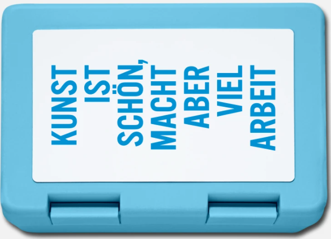

layout: true
  

  <table>
    <tr>
      <td style="text-align:right">Sächsische Landesbibliothek – Staats- und Universitätsbibliothek</td>
      <td>2023-03-01</td>
      <td style="text-align:right"><a href="https://www.slub-dresden.de/">www.slub-dresden.de</a></td>
    </tr>
    <tr>
      <td style="text-align:right">Referat 4.3</td>
      <td />
    </tr>
  </table>

  <table>
    <tr>
      <td style="text-align:left"><b>Kay-Michael Würzner</b></td>
    </tr>
    <tr>
      <td style="text-align:left">Referat 4.3</td>
    </tr>
    <tr>
      <td style="font-size:8pt"><b>2023-03-01</b></td>
    </tr>
    <tr>
      <td style="font-size:8pt">Information Event on NFDI, Research Data Management and Open Science</td>
    </tr>
  </table>

---

class: title-slide
count: false

# Open Science
## An introduction with an outlook to the SLUB Open Science Lab

---

# Overview

- What is *open science*?
    + Scientific method and open science aspects
    + The openness puzzle
    + (Pros and Cons)
- The SLUB Open Science Lab

---

class: part-slide
count: false

# What is *open science*?

---

# What is *open science*?

.cols[
.fifty[
- Free and (un-)restricted access to **scientific research**
   + At all stages of the research process
   + Not restricted to STEM disciplines
       * **Open research**
       * **Open scholarship**
- With all its **advantages**, **risks** and **challenges**
]
.fifty[

]
]

---

# Scientific method and openness

- Multiple stages of the research process
- Corresponding open science aspects

By Efbrazil - Own work, CC BY-SA 4.0, https://commons.wikimedia.org/w/index.php?curid=102392470

---

# Scientific method and openness

- Multiple stages of the research process
- Corresponding open science aspects

By Efbrazil - Own work, CC BY-SA 4.0, https://commons.wikimedia.org/w/index.php?curid=102392470

---

# The openness puzzle

---

# Open X

- Not a strict terminology
- Not a complete picture
    + Open Innovation
    + Open Leadership
    + ...
- FAIR principles
    + Make it **findable**: *platform*
    + Care for **accessibility**: *documentation*
    + Mind the **interoperability**: *file format*
    + Clarify **reuse**: *license*

---

# Open Access

.cols[
.fifty[
- Free access to **research results and publications** and their (un-)restricted reusability
    + Well-established concept (approx. 60 % of TU publications are OA)
    + Various types of OA: *gold*, *green*, *diamond*
    + Adopted by commercial publishers
- Often mixed with other openness aspects
]
.fifty[

]
]

---

# Open Access

---

# Open Methodology

.cols[
.fifty[
- Opening up methods to achieve scientific results 
    + Data acquisition
    + Data analysis
- **Preregistration**: Early sharing of research questions and approach
    + Preregistered reports
        * Twostage reviewing process
        * Often with early acceptance
        * **Less** file drawer research, *p*-hacking, HARKing
    + [Open Science Framework](https://osf.io)
]
.fifty[

]
]

---

# Open Data

.cols[
.fifty[
- Free access to **research data** and their (un-)restricted reusability
    + Standardized metadata
    + Documentation!
    + Various existing publication platforms (i.e. *repositories*)
        * Institutional (e.g. `OpARA`)
        * Disciplinary (e.g. `PsychData`)
        * Universal (e.g. `Zenodo`)
]
.fifty[

By David Mellor!Original: AinaliVector: AntiCompositeNumber - https://osf.io/tvyxz/, CC BY 4.0, https://commons.wikimedia.org/w/index.php?curid=64318717

]
]

---

# Open Source

.cols[
.fifty[
- Free access to **research software** and their (un-)restricted reusability
    + Vast amount of possible licenses
    + Free use vs. modifiability
    + Adopted by software companies
- `GitHub` as the de-facto standard for publishing research software
- Together with OA, OM, OD → **Open Reproducible Research**
]
.fifty[

]
]

---

# Open Source

---

# Open Source

---

# Open Evaluation

- Development of a **fair evaluation** system based on standardized protocols and transparent metrics
    + Open peer review
        * Open identities of authors **and** reviewers
        * Published reviews
        * Wider contribution possibilities for the scientific community
- Alternatives for measuring scientific outreach
    + Moving beyond *Journal Impact Factor* **and** *Web of Science*

---

# Open Educational Resources

.cols[
.fifty[
- Free access to **teaching and learning materials** and their (un-)restricted reusability
    + Not strictly part of Open Science
    + Important part of an **open academic culture**
- Dedicated platforms like `Opal` and aggregators like [`OERSI`](https://oersi.de/)
- Increased relevance during the covid-19 pandemic
    + Barrier-free
]
.fifty[

By Jonathasmello - Own work, CC BY 3.0, https://commons.wikimedia.org/w/index.php?curid=18460156

]
]

---

# Open Cultural Heritage

.cols[
.fifty[
- Free access to **archival holdings, library collections and works of art** and their (un-)restricted reusability
- Often granted through digitization
- Multi-dimensional access
    + Materiality!
- Including descriptions of the creative process and provenance
]
.fifty[

By Open Knowledge Foundation - http://openglam.org/files/2012/04/OpenGLAM-logo.png, CC BY 3.0, https://commons.wikimedia.org/w/index.php?curid=25209995

]
]

---

class: part-slide
count: false

# The SLUB Open Science Lab

---

# The SLUB Open Science Lab

1. Bundling of advisory and educational **services** to support an open research cycle
2. Attractive and modernly equipped work, event and meeting **place**
3. Centrally situated, university-wide **icon** for the importance of open science

---

# Advisory and educational services

.cols[
.sixty[
- Support of an open scientific culture central part of
  [SLUB strategy](https://nbn-resolving.org/urn:nbn:de:bsz:14-qucosa2-357501)
    ]
.fourty[

]
]
- Services around an open research cycle
    * **Open Access**: Financing and licensing issues; publication infrastructure
    * **Open Data**: (Meta-)Data formats; repositories; technical workflows
    * **Open Methodology**: Pregistration and registered reports; Open Science Framework
    * **Open Evaluation**: Bibliometric analyses for optimized outreach and objective impact estimation

---

# Advisory and educational services

- Services in an openness ecosystem
    * **Open Educational Resources**: Methodology and tools; licensing issues
    * **Citizen Science**: Connecting professional and non-professional scientific contexts
    * **Open Science practices**: Advisory programme for Horizon Europe applications
    * **Science communication**: Scientific blogging; predatory journals; academic identity management

---

# Advisory and educational services

- **Talks**, e.g. at
    * International Open Access Week
    * Graduate Academy
    * Lessons in Open Science
- **Individual advice**, e.g. at
    * SLUB Knowledge Bar
    * Subject librarians
    * SLUB Helpdesk
- **Self-study materials** on
    * [YouTube](https://www.youtube.com/user/slubdresden)
    * [Opal](https://bildungsportal.sachsen.de/opal/auth/repository/catalog/548470806;jsessionid=1E37A405717942198827CEFF6E38A0D8.opalN5)

---

# Advisory and educational services

- In cooperation with academic partners at TUD (and beyond)
    * [Service Center Research Data](https://tu-dresden.de/forschung-transfer/services-fuer-forschende/kontaktstelle-forschungsdaten)
    * [Centre for Interdisciplinary Learning and Teaching (ZiLL)](https://tu-dresden.de/tu-dresden/organisation/rektorat/prorektor-bildung/zill)
    * [European Project Center](https://tu-dresden.de/forschung-transfer/services-fuer-forschende/european-project-center)
    * [Open Science Initiative](https://tu-dresden.de/mn/psychologie/die-fakultaet/open-science)
    * [SaxFDM](https://saxfdm.de/)
    * ...

---

# Work, event and meeting place

.cols[
.fifty[
- Planned since 2018
- Strategy paper “SLUB 2025”
- Modernization of the service portfolio pf scientific libraries
    + SLUB Makerspace
    + SLUB TextLab
    + Musicspace/A-V Lab
    + ...
- Prototype: [OSL at TIB Hannover](https://www.tib.eu/de/forschung-entwicklung/forschungsgruppen-und-labs/open-science)
]
.fifty[

]
]

---

# Work, event and meeting place

- Grand opening in November 2022
- Interim at Zellescher Weg 21 (*zell21*)

.cols[
.fifty[

]
.fifty[

]
]

---

# Work, event and meeting place

.cols[
.fifty[
- Mixture of bookable and freely usable workplaces
- Three larger event rooms
    + OSL 1: up to 70 p.
    + OSL 2 & 3: up to 30 p.
    + Each with flexible furniture
- Open Science Desk
- Technical equipment for hybrid events
    + Projectors, digital whiteboards
    + Mobile cameras, microphones, speakers etc.
- **Kitchen**
]
.fifty[

]
]

---

class: part-slide

# Many thanks for your attention!

<a href="https://wrznr.github.io/os-osl-osc-2022/">wrznr.github.io/os-osl-osc-2022</a>

---

# Why Open Science?

---

# Why not Open Science?

1. “Copyright”
2. “Marketability”
3. “Effort”

---

# Why not Open Science?

1. **“Copyright”**
2. “Marketability”
3. “Effort”

.cols[
.fifty[

]
.fifty[

]
]

---

# Why not Open Science?

1. “Copyright”
2. **“Marketability”**
3. “Effort”

.cols[
.fifty[

]
.fifty[

]
]

---

# Why not Open Science?

1. “Copyright”
2. “Marketability”
3. **“Effort”**

.cols[
.fifty[

]
.fifty[

]
]

