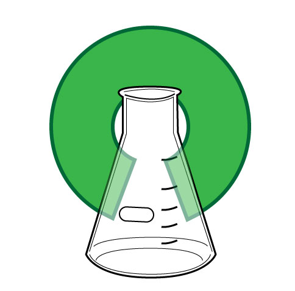
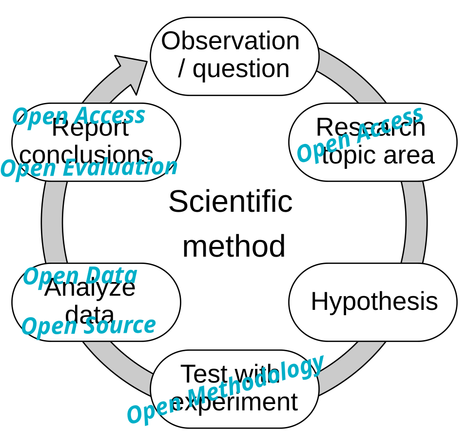
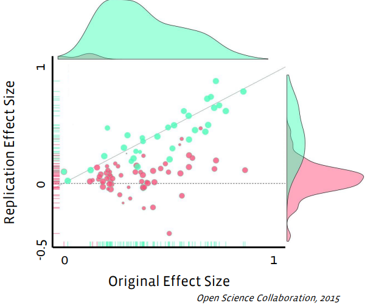
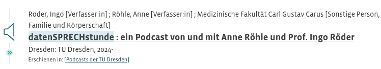
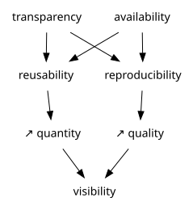

layout: true
  

  <table>
    <tr>
      <td style="text-align:right">Sächsische Landesbibliothek – Staats- und Universitätsbibliothek</td>
      <td>2026-08-26</td>
      <td style="text-align:right"><a href="https://www.slub-dresden.de/">www.slub-dresden.de</a></td>
    </tr>
    <tr>
      <td style="text-align:right">Research-related services</td>
      <td />
    </tr>
  </table>

  <table>
    <tr>
      <td style="text-align:left"><b>Kay-Michael Würzner</b></td>
    </tr>
    <tr>
      <td style="text-align:left">Research-related services</td>
    </tr>
    <tr>
      <td style="font-size:8pt"><b>2026-08-26</b></td>
    </tr>
    <tr>
      <td style="font-size:8pt">Centre for Tactile Internet with Human-in-the-Loop</td>
    </tr>
  </table>

---

class: title-slide
count: false

# Services for a sustainable and transparent research process

---

# Overview

- Personnel
- Structure of the Workshop
  + Roads to Open Access
  + Preserving and Publishing Research Data
  + Subject-specific Research Tools
- Path to *Open Science*?

---

# Personnel

|  | Name | Function / Role |
| :---: | :--- | :--- |
|  | **Josephine Hartwig** | FR politics and social science, Team Publia |
|  | **Jana Schumm** | FR medicine, acquisition management |
|  | **Kay-Michael Würzner** | FR computer science, research-related services |
|  | **Katharina Zinke** | FR psychology, research data management |

---

class: part-slide
count: false

# Paths to *open science*?

---

# What is *open science*?

.cols[
.fifty[
- Free and (un-)restricted access to **scientific research**
   + At all stages of the research process
   + Not restricted to STEM disciplines
       * **Open research**
       * **Open scholarship**
- With all its **advantages**, **risks** and **challenges**
]
.fifty[

]
]

---

# Scientific method and openness

- Multiple stages of the research process
- Corresponding open science aspects

By Efbrazil - Own work, CC BY-SA 4.0, https://commons.wikimedia.org/w/index.php?curid=102392470

---

# Scientific method and openness

- Multiple stages of the research process
- Corresponding open science aspects

By Efbrazil - Own work, CC BY-SA 4.0, https://commons.wikimedia.org/w/index.php?curid=102392470

# Open X

- Not a strict terminology
- Ecosystem surrounding scientific research
    + Open Innovation
    + Open Cultural Heritage
    + ...
- FAIR principles
    + Make it **findable**: *platform*
    + Care for **accessibility**: *documentation*
    + Mind the **interoperability**: *file format*
    + Clarify **reuse**: *license*
- Early sharing
    + Make knowledge available asap.
    + Involve others
    + Be open for feedback

---

# Open Methodology

.cols[
.fifty[
- Opening up methods to achieve scientific results 
    + Data acquisition
    + Data analysis
- **Preregistration**: Early sharing of research questions and approach
    + Preregistered reports
        * Two-stage reviewing process
        * Often with early acceptance
        * **Less** file drawer research, *p*-hacking, HARKing
    + [Open Science Framework](https://osf.io)
    + [Research Box](https://researchbox.org/)
]
.fifty[

]
]

---

# Spotlight: Registered Reports

.cols[
.sixty[
* **Stage 1 Peer Review:** Review of Intro + Methods.
    * Result: *In-Principle Acceptance (IPA)*.
* **Research Phase:** Conduct study.
* **Stage 2 Peer Review:** Review of Results + Discussion.
    * Check: Did they follow the plan?
]
.fourty[

]
]
* **Result:** Publication (regardless of null results).
    * *Medical Journals:* [*BMC Medicine*](https://link.springer.com/journal/12916/submission-guidelines/registered-reports), [*PLOS Biology*](https://doi.org/10.1371/journal.pbio.3001611), [*Nature Human Behaviour*](https://doi.org/10.1038/s41562-018-0399-z).
    * Computer Science Journals: [*Empirical Software Engineering*](https://link.springer.com/journal/10664/submission-guidelines), [*ACM Transactions on Human-Robot Interaction*](https://dl.acm.org/journal/thri), [*PeerJ Computer Science*](https://peerj.com/journals/computer-science) 
    * Electronics: [*Discover Elctronics*](https://link.springer.com/journal/44291), [*HardwareX*](IEEE Transactions on Human-Machine Systems)

---

# Openness is a Spectrum

<h3>"Open" ≠ "Public"</h3>

Openness defines <b>process transparency</b>, not necessarily immediate public data availability.

.cols[
.fifty[
### Path 1: “Sensitive”
*For clinical trials, patient data ...*
 
**"As open as possible, as closed as necessary."**
]
.fifty[
### Path 2: “Progressive”
*For meta-analyses, anon. data, simulations*
 
**"Born Open."**
]
]

---

# Path 1: The “Sensitive” Approach

No data publication (GDPR), but share the **research process**.

.cols[
.fifty[
1. **Open Protocol:**
   * Registered on [*ClinicalTrials.gov*](https://clinicaltrials.gov/) or [*DRKS*](https://www.bfarm.de/DE/Das-BfArM/Aufgaben/Deutsches-Register-Klinischer-Studien/Studienerfassung/_node.html)
2. **Open Code:**
   * Analysis scripts (R/Python) on *GitHub*
   * Allows check of statistical logic without seeing data
3. **Controlled Data:**
   * Public metadata (Findable)
   * Dataset in a repository (e.g., [*Vivli*](https://vivli.org/), [*YODA*](https://www.uu.nl/en/research/yoda)) with a **Data Access Committee**
]
.fifty[

<b>FAIR Data</b> Findable: ✅ Accessible: 🔐 (Request) Interoperable: ✅ Reusable: ✅ (with permission)

]
]

---

# Example 1

**Context:** [SPRINT trial (2015)](https://doi.org/10.1056/nejmoa1511939), blood pressure trials
 **Openness:** **Controlled access** via secure environment

.cols[
.fifty[
* [*Basu et al. (2017)*](https://doi.org/10.1371/journal.pmed.1002410)
  * Finalist of the [*NEJM* SPRINT Challenge](https://doi.org/10.1056/nejmp1705323)
  * **Secondary analysis** of shared data
  * Developed a "Benefit/Harm" risk score
  * Identified subgroups where aggressive treatment was harmful
  * **Value:** Nuanced clinical care via data reuse
]
.fifty[

* [*Basu et al. (2021)*](https://doi.org/10.1371/journal.pmed.1003785)
  * Transparent correction of a caption error
  * “Micro” publication
]
]

---

# Path 2: The “Progressive” Approach

Ideal for studies where data sensitivity is low or fully anonymized.

.cols[
.fifty[
1. **Preregistration:**
   * **Open Science Framework (OSF)**
   * "Frozen" timestamped plan prevents *p-hacking* and *HARKing*
2. **Born-Open Workflow:**
   * Lab notebook / Data collection openly documented
3. **Registered Report:**
   * Peer review **before** results
   * Acceptance based on method quality
]
.fifty[

<b>Full Transparency</b> Project Wiki Files Registration

]
]

---

# Example 2:

.cols[
.fifty[
* [*Gonçalves et al. (2022)*](https://doi.org/10.1007/s10664-022-10123-8)
  * Effect of providing explicit and structured checklists on code review quality
  * Comparison of professional software developers and computer science students
  * Hypotheses and experimental design [preregistered with OSF](https://doi.org/10.17605/OSF.IO/5FPTJ)
  * Data and materials available in a [“replication package” on Zenodo](https://doi.org/10.5281/zenodo.5653341)
]
.fifty[

* Started out as a conference publication [(MSR 2020)](https://2020.msrconf.org/)for the preregistered part
* Final publication including experimental results and interpretation as a journal article
]
]

# Example 3:

.cols[
.fifty[
* [*Camerer et al. (2018)*](https://doi.org/10.1038/s41562-018-0399-z)
  * **"The Social Sciences Replication Project"**
  * Replicated 21 high-profile studies from *Nature* and *Science*
  * Found that only **62%** of findings could be replicated
  * Used **Preregistration** to guarantee unbiased results
]
.fifty[

* Paper itself not Open Access
* [OSF presence](https://osf.io/pfdyw/overview) is!
]
]

---

# Science Communication: Opening up to Society

.cols[
.fifty[
**Why bother?**
* **Visibility:** "The Sagan Effect" ([Public engagement ↑ Citations](https://doi.org/10.1177/1077699014550092))
* **Trust:** Combat misinformation directly
* **Funding:** Often a mandatory grant deliverable

]
.fifty[
**The Channels**
* **Digital:** Blogs, Podcasts, LinkedIn/BlueSky
* **Physical:** Science Slams, Open Lab Days

]
]

---

# Local Support: Science Communication

**Scope:** Professional production

.cols[
.sixty[
**SLUB Studios** (Zentralbibliothek)
* **Podcast Studio**
   + 4 Mics (Røde), Headsets, *Podtrak*
   + Software: *Audacity*, *Reaper* (Ultraschall), *Cubase*
   + Ideal for: Interview podcasts, Audioguides
* **Greenscreen Studio**
   + Prof. Lighting, 4K Camera, Teleprompter
   + Software: *OBS Studio*, *Cinector*
   + Ideal for: Explainer videos, Course teasers
]
.fourty[
 

]
]

---

# Local Support: Science Communication

**Scope:** Mobile equipment

.cols[
.fifty[
 
 

]
.fifty[
**Library of Things** (Ausleihe)
* **Mobile Equipment** (14 days loan)
   + **Audio:** *Zoom* Recorders, Clip-on mics
   + **Video:** *GoPro* cameras, 360° cameras
   + **Interactive:** VR Glasses (*Oculus*), *OrCam*
* **Post-Production**
   + Powerful media workstations in the library
]
]

---

# The SLUB Open Science Lab

1. Bundling of advisory and educational **services** to support an open research cycle
2. Attractive and modernly equipped work, event and meeting **place**
3. Centrally situated, university-wide **icon** for the importance of open science

---

# Principles of Open Science at TUD

**Status:** Official commitment to transparency, reproducibility, and participation.

.cols[
.fifty[
* **Standardization:** Integration of Open Science into the daily research workflow.
* **Open Access:** Priority for free, permanent digital access to publications.
* **FAIR Data:** Research data should be Findable, Accessible, Interoperable, and Reusable.
]
.fifty[
* **Methodological Transparency:** Promotion of Preregistration and Open Code.
* **Evaluation:** Recognition of "Openness" in career development and hiring.

]
]

---

# Discussion: Why Open Science?

---

class: part-slide

# Many thanks for your attention!

<a href="https://wrznr.github.io/os-osl-osc-2022/">wrznr.github.io/os-osl-osc-2022</a>

