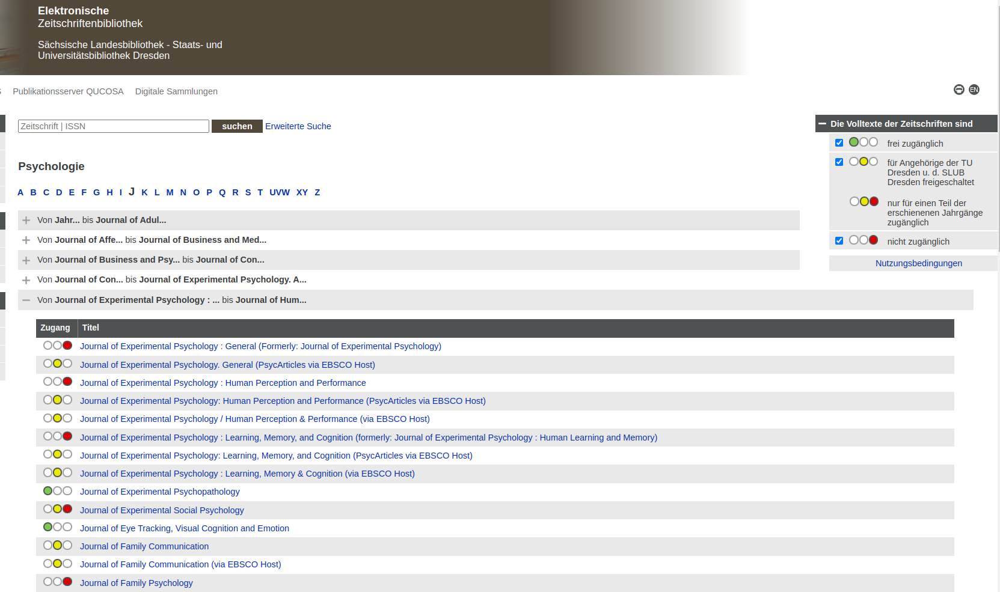
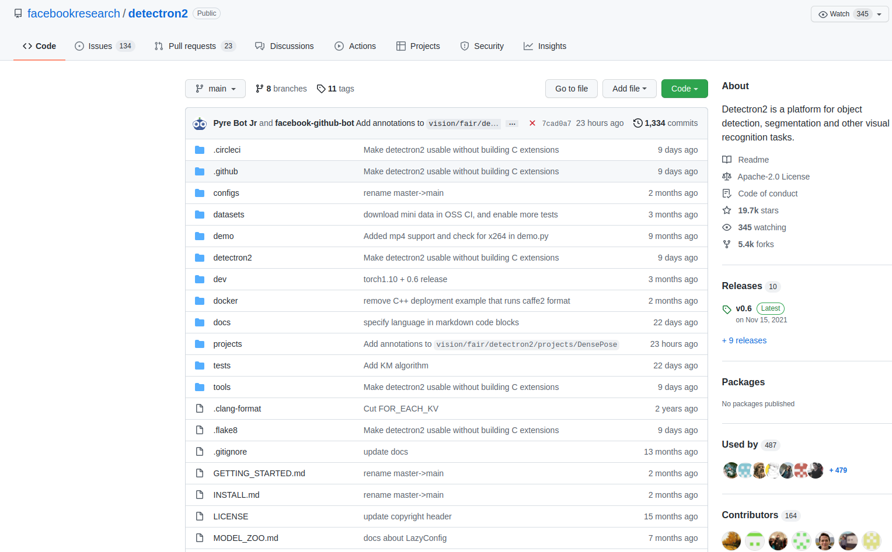
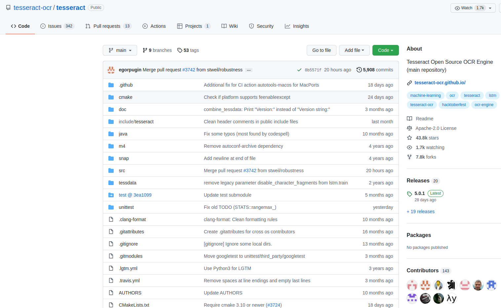
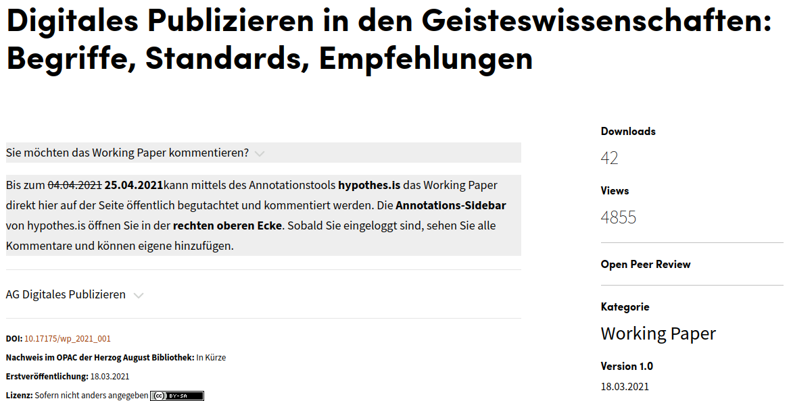

<!--
---

# Open Access

.cols[
.fifty[
- Free access to **research results and publications** and their (un-)restricted reusability
    + Well-established concept (approx. 60 % of TU publications are OA)
    + Various types of OA: *gold*, *green*, *diamond*
    + Adopted by commercial publishers
- Often mixed with other openness aspects
]
.fifty[

]
]

---

# Open Access

---

# Open Source

.cols[
.fifty[
- Free access to **research software** and their (un-)restricted reusability
    + Vast amount of possible licenses
    + Free use vs. modifiability
    + Adopted by software companies
- `GitHub` as the de-facto standard for publishing research software
- Together with OA, OM, OD → **Open Reproducible Research**
]
.fifty[

]
]

---

# Open Source

---

# Open Source

---

# Open Evaluation

- Development of a **fair evaluation** system based on standardized protocols and transparent metrics
    + Open peer review
        * Open identities of authors **and** reviewers
        * Published reviews
        * Wider contribution possibilities for the scientific community
    + Alternatives for measuring scientific outreach
        * Moving beyond journal-based quality assessment (i.e. *Journal Impact Factor*)

---

# Open Educational Resources

.cols[
.fifty[
- Free access to **teaching and learning materials** and their (un-)restricted reusability
    + Not strictly part of Open Science
    + Important part of an **open academic culture**
- Dedicated platforms like `Opal` and aggregators like [`OERSI`](https://oersi.de/)
- Increased relevance during the covid-19 pandemic
    + Barrier-free
]
.fifty[

By Jonathasmello - Own work, CC BY 3.0, https://commons.wikimedia.org/w/index.php?curid=18460156

]
]

---

# Example 3:

.cols[
.fifty[
* [*Errington et al. (2021)*](https://doi.org/10.7554/eLife.71601)
    * Massive effort to replicate 50 high-impact cancer studies
    * **Open Access** (published in *eLife*)

]
.fifty[
* The outcome
    * **46%** successful replication rate
    * Effects were often **85% smaller** than in original papers
    * [Preregistered](https://osf.io/collections/rpcb/) with OSF

]
]

---

class: part-slide
count: false

# Support Structures

---

# Excursus: NFDI4Health

The **National Research Data Infrastructure for Personal Health Data**.

.cols[
.sixty[
**Goal:** Enable scientific use of personal health data while respecting privacy

* **Services**
    * **German Central Health Study Hub**
        * *The* search portal for clinical & epi studies in Germany
        * Find metadata, protocols, and data access routes
    * **Metadata Schema**
        * Standardized way to describe health studies (FAIR)
    * **Legal Helpdesk**
        * Guidance on GDPR and broad consent
]
.fourty[

  
<a href="https://health-study-hub.de/">www.health-study-hub.de</a>

]
]

---

# Service Center Research Data (Kontaktstelle Forschungsdaten)

**Scope:** All disciplines / General RDM questions

.cols[
.sixty[
**Services**
* **DMP Support**
   + Review of Data Management Plans
   + Templates for grant applications (DFG, EU)
* **Publication Advice**
   + Repository selection (*Opara*, *Zenodo*)
   + Licensing questions (CC-BY, etc.)
* **Training**
   + Workshops on RDM techniques
]
.fourty[

]
]

---

# Independent Trustee Office (Unabhängige Treuhandstelle)

**Scope:** Clinical trials / Patient data / GDPR compliance

.cols[
.sixty[
**Core Functions**
* **Identity Management**
   + Separation of identifying data (ID) from medical data (MD)
   + Generation of pseudonyms (PSN)
* **Consent Management**
   + Storage of Informed Consent forms
   + Handling of consent withdrawal
* **Data Transfer**
   + Secure linkage for researchers (without ID access)
]
.fourty[

]
]

---

# SLUB Publication Services

**Scope:** Financing, Licensing, Strategy

.cols[
.fifty[
**Advisory Services**
* **Publication Strategy**
   + Journal selection (Visibility vs. Impact)
   + Identification of *Predatory Journals*
* **Legal & Technical**
   + Copyright & Licenses (CC-BY advice)
   + Author Identification (*ORCID*)
   + TUD Affiliation Guidelines
]
.fifty[
**Financial Support**
* **Publication Fund**
   + Funding for *Gold Open Access*
   + For pure OA journals 
* **Transformation Agreements (DEAL)**
   + "Read & Publish" options
   + Central billing for *Wiley*, *Springer Nature*, *Elsevier*
* **Membership Discounts**
   + Reduced fees (e.g., *Frontiers*, *MDPI*)
]
]

---

# SLUB Publia – Diamond Open Access, made in Dresden

**Scope:** Hosting for **your own** Journals, Conference Proceedings, and Schriftenreihen.

.cols[
.fifty[
* **Diamond Open Access:**
   Free for authors, free for readers. No APCs.
* **Infrastructure:**
   Professional hosting via *OJS* (Journals) or *OMP* (Books).
* **Services:**
   + DOI assignment & ISSN/ISBN
   + Long-term archiving
   + Custom corporate design
]
.fifty[

  

<b>Why choose this?</b> 
Don't just pay for Open Access. 
<b>Create it.</b> 
 
<i>Ideal for conference proceedings and institute series.</i>

 
<small><a href="https://www.slub-dresden.de/veroeffentlichen/publia-slub-open-publishing">slub-dresden.de/publia</a></small>

]
]

---

-->
